# Pokémon Legends
Welcome to Pokémon Legends! Here, you will get to experience a simple Pokémon game, with references to the official Pokémon game battles and some of their systems, with a tint of retro! All feedbacks regarding the game for improvements are welcome!

## Context
Pokémon Legends is a game project done during my education with Trent Global College. In this project, I will be utilising and demonstrating what I learnt during my bootcamp about Vue, Express and MongoDB to develop a reactive frontend frameworks game, website and RESTful API.

My goal is to create a simple, yet attractive and interactive single page application website, together with a mini game using my knowledge with Vue JS. I want to ensure that my visitors will enjoy their time here with us!

# Demo
The demo of the site is available [here](https://yuhengen.github.io/TGC9-Proj2-PokeLegends-vue)!

*NOTE: The game is currently not optimized for mobile in portrait mode and is thus not fully mobile responsive.

---

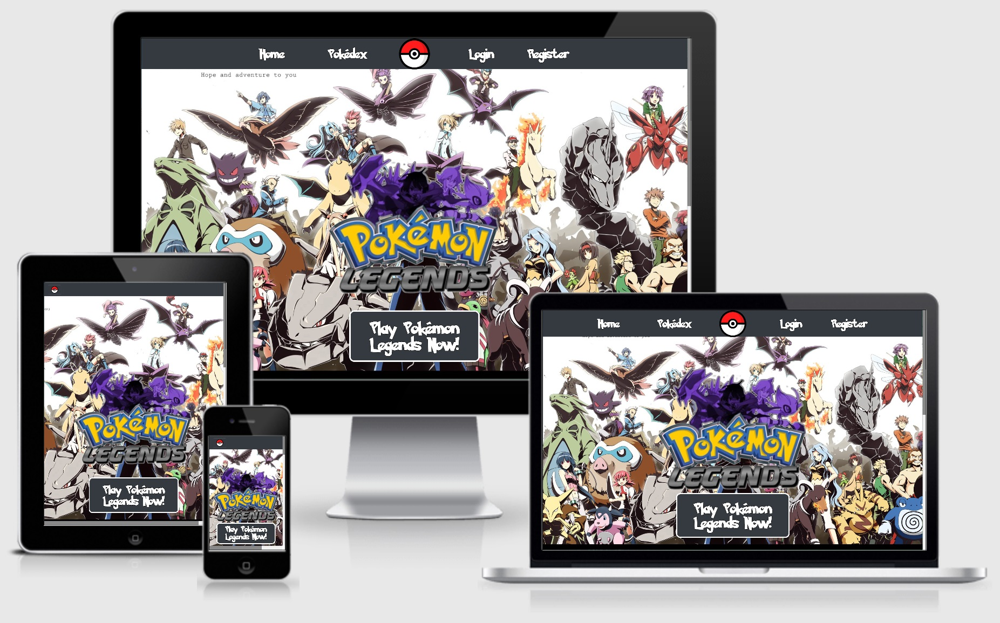

---

# Note
This repository only contains the frontend codes for the Pokémon Legends project.
Backend codes can be found at [TGC9-Proj2-PokéLegends-api](https://github.com/yuhengen/tgc9-proj2-PokeLegends-api).

# UI/UX
# Identifying the Users (STRATEGY)
The primary purpose of this website is to allow players to play the Pokémon Legends game on both PC and mobile (In the future). This is a simple simulation of the official Pokémon game series on Nintendo consoles, mainly targeting Pokémon fans and gamers in general.

## Owner Stories
```
- As the developer of the game, I want to create a user-friendly and fun game so that my players will enjoy their time in the game.
- As the developer of the game, I want to ensure that the game remains as close to a Pokémon game as possible, so that fans of the Pokémon games have a sense of familiarity and reminiscence with us.
```

## User Stories (Players & Visitors)
```
- As a player, I want to find a good Pokémon game so that I can spend some of my free time on the game as a source of entertainment.
- As a player, I want a website where I can preview the game and its contents so that I will know whether to try the game out or not.
```

# The Requirements (SCOPE)
## Current Features
```
- Sign up for an account
- Login to the account
- Play the game on browser with a PC or Android/Apple phones (In the future), designed with Vue
- Conduct random and gym battles in the game
- Theme music playing in the game, switching to other theme background music when necessary
- Access to a Pokédex to view the entire list of Pokémon
- Auto save and load the game to and from MongoDB database
- Ease of navigation with Bootstrap Navbar
- Mobile responsiveness (Website)
```
## Features to Implement in Future
```
- Game Tutorial
- Adding loading screen to pages that require load time
- Add function to prompt user confirmation on whether they want to navigate away from the game window
- Add function to allow users to update profile
- Privacy Policy page (When necessary)
```

# Developing the Site Structure (STRUCTURE)
### Website
The Pokémon Legends website has a navigation bar and footer on every page, allowing users to access most available page with ease.

### Game
The Pokémon Legends game has navigation buttons at the main menu screen of the game, allowing players to access most of the game functions with ease. All the personal game data that the players need to access can be seen in the game

## Sitemap

---

The sitemap of the project will be available soon...

---

# Developing Page Structure and Organize Interactions (SKELETON)
Most important features of Pokémon Legends are featured first. We want our players to play our game and at the same time know more about Pokémon Legends, so the PLAY button is the first thing they see upon entering the site with more information regarding the game on the same page.

## Wireframes

---

The wireframes of the project will be available soon...

---

# Designing the Graphics User Interface (SURFACE)
## Colors
After some research and considerations, the main colors I decide to use for the website are those that are similar to a Pokéball, and the neutral colors that can blend in most situations.
```
- Black/Grey for background, buttons and windows due to it being able to blend in most situations
- Red + White combination to match colors for a Pokéball
- White mainly used for texts to contrast the dark colors which are used as background
```

## Fonts
The font mainly used on the website is Sans Serif, the default font family, which is often used to convey modernity or minimalism.
Secondary fonts used are [Pokémon Font](https://www.dafont.com/Pokémon.font) for the navigation bar, and the [Nintendo Pixel Font](https://www.fontspace.com/press-start-2p-font-f11591) as main font for the game to bring forth a retro look.

# Step-by-Step Testing

## Register for Account
- ✅ Tap on registration in Navbar
- ✅ Keying in the necessary information (Email Address, Username, Password, Re-type Password and Gender) will allow the registration of a new unique account. Contains form validation to ensure form is properly filed up
- ✅ Entered Username will be displayed as character name in-game
- ✅ Selected Gender will determine your in-game character
- ✅ Tap on REGISTER to register your free account
- ✅ After successful registration, you will be routed to [Play Pokémon Legends](https://8080-c1affde1-a811-46d2-9345-b1ed65ca2518.ws-us03.gitpod.io/#/game)

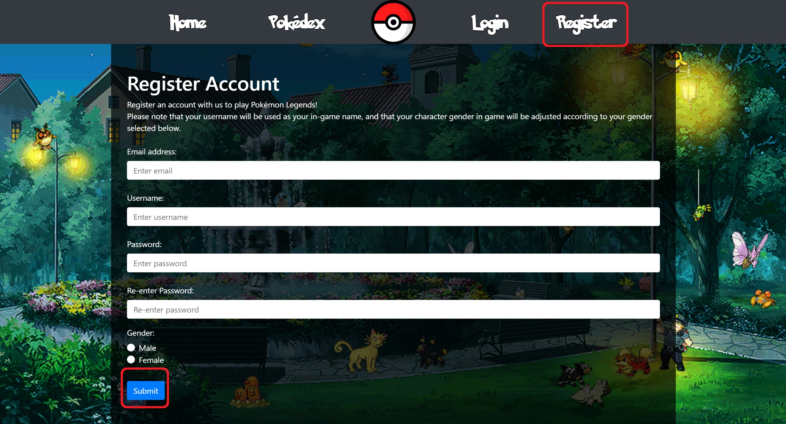

## Login
- ✅ Type in the username and password of your previously registered account and tap on LOGIN
- ✅ Keying in a registered account username will allow users to login and retrieve data from their previous save. Contains form validation to ensure form is properly filed up
- ✅ Pressing register will lead to registration page

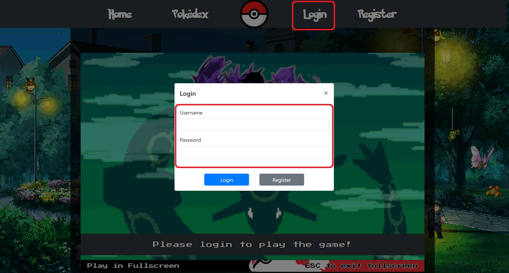

## Game
### Start Page
- ✅ Once logged in, the LOGIN button will be PROFILE, where you can use to logout. The REGISTER button will become PLAY where it will lead to the game page
- ✅ Click 'Play in Fullscreen' to enjoy the game in fullscreen mode
- ✅ Click on "Welcome, 'username' Click to start game" to proceed to the game

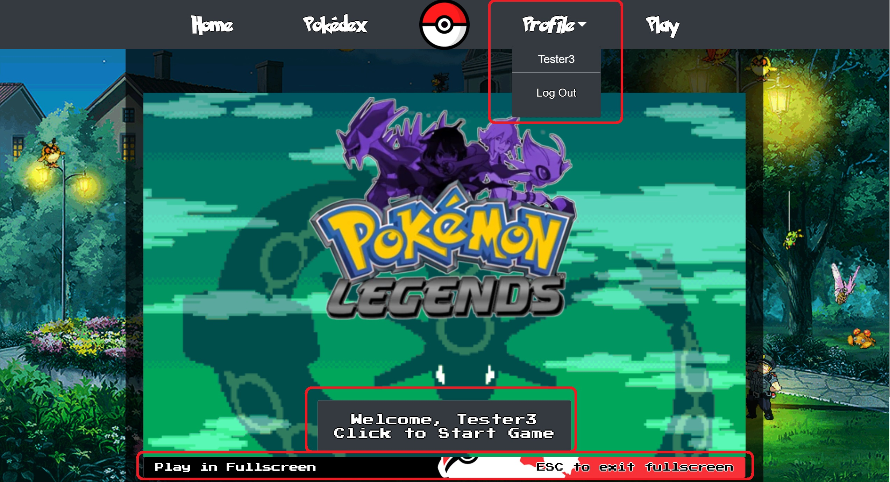

### Introduction
- ✅ New accounts should go through an introduction for the game. Click on the textbox to read through the short intro
- ✅ After which, you will get 1000 Pokedollar and 3 Rare Candies at the end of the intro
- ✅ You will be directed to select a starter Pokemon. Click on SELECT after you have decided and the game will automatically save your progress after doing so
- ✅ You will then be led to the game menu page

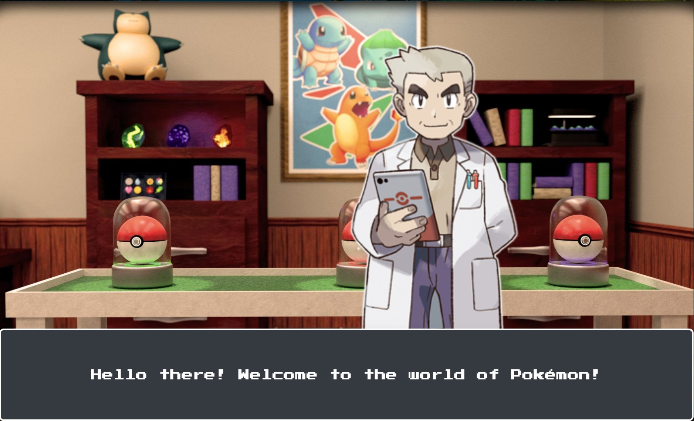
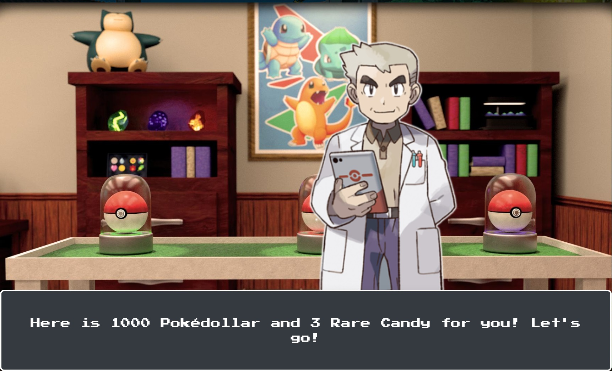
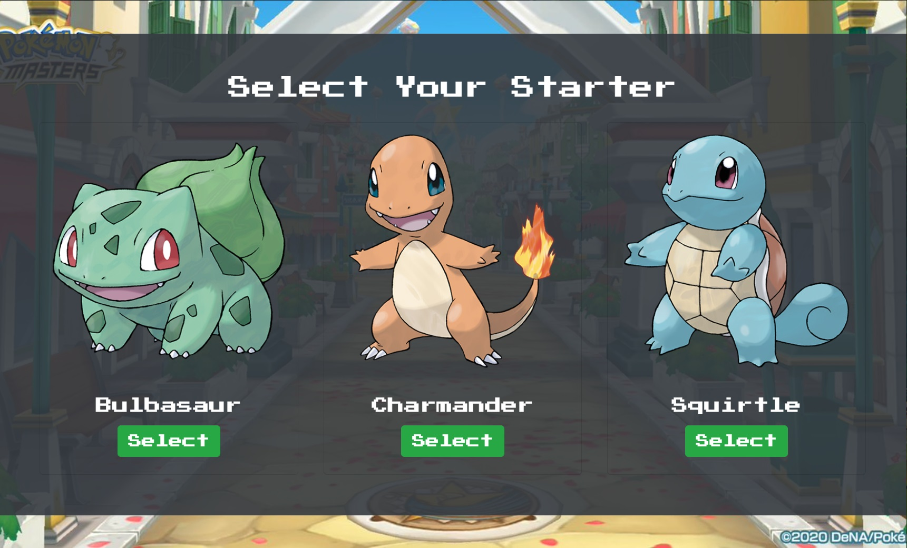

### Game Menu
- ✅ Clicking on BATTLE in the middle of the screen will bring you to Battle Selection page
- ✅ Clicking on your character portrait or the Pokeball icon on the top right will open the User Info panel where some of your data (Username, Pokedollar, Party Pokemon etc) will be displayed
- ✅ Clicking on POKEDEX opens the Pokedex page to view the whole list of Pokemon
- ✅ Clicking on POKEMON opens the Pokemon page to view your party of Pokemon and their stats/movesets
- ✅ BAG is still a work in progress
- ✅ Clicking on +1000 Poke$ adds 1000 Pokedollars to your account and autosaves

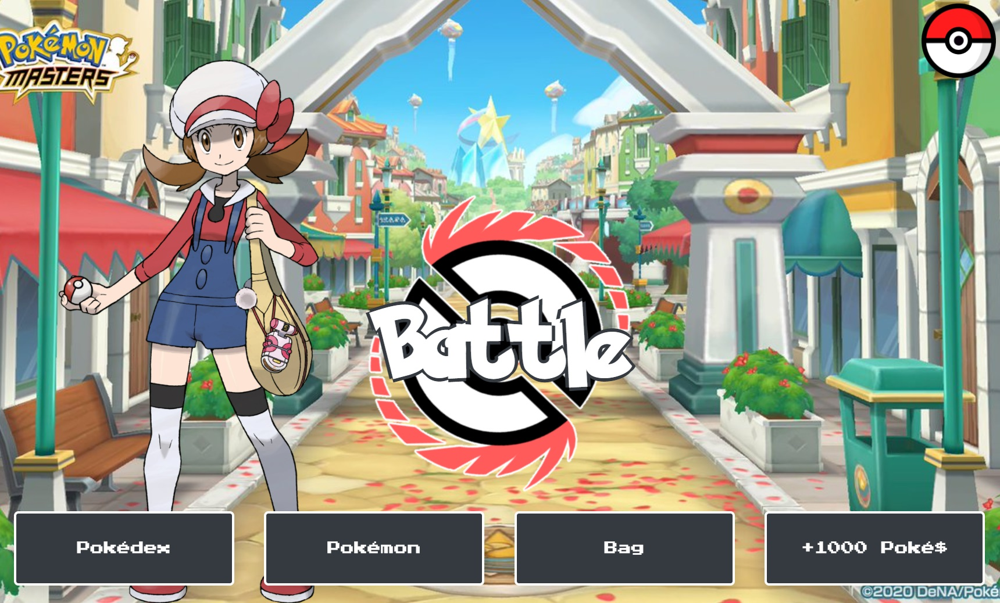

### Battle Selection
- ✅ Select RANDOM WILD BATTLE to start a battle with a random Pokemon
- ✅ Select GYM BATTLE to select a Gym Leader to start a battle
- ✅ Click on cancel button at the top right to close the selection screen

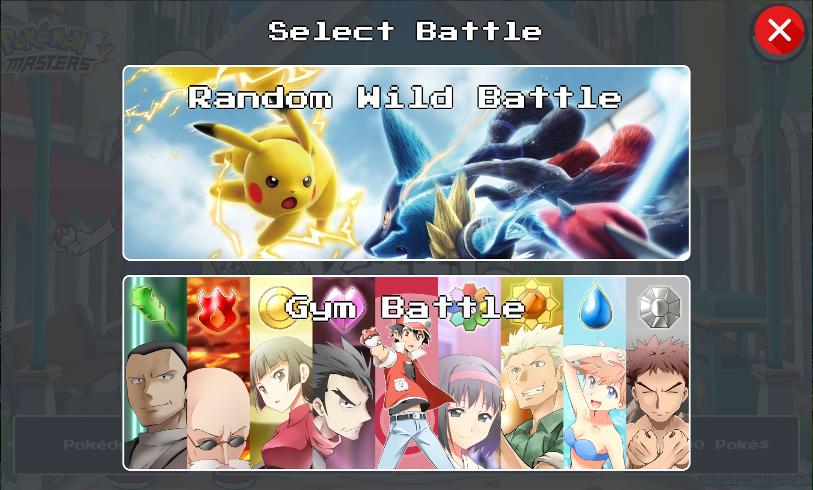
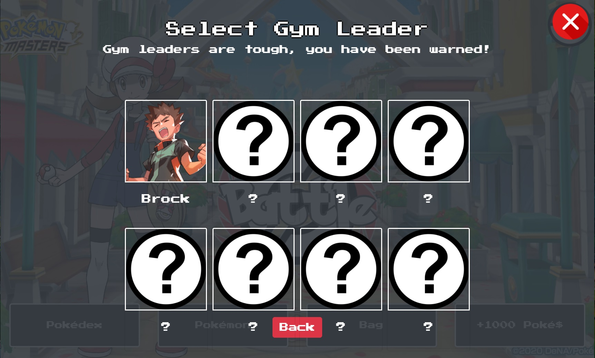

### Gym Battle/Wild Pokemon Battle
- ✅ In the battle, you will face off against an opponent and brawl it out. Whichever Pokemon's HP that is reduced to 0 loses the battle
- ✅ Select FIGHT to select from a list of moves. Each of them has their own Power, which is calculated into damage dealt to opposing Pokemon
- ✅ If you win the battle, you will get rewards such as Rare Candy and Pokedollar. The game will then autosave and redirect to the Game Menu page
- ✅ If you lose the battle, you will lose some Pokedollars. The game then autosaves and redirect to the Game Menu page
- ✅ Select RUN to escape from the battle. No penalties will occur

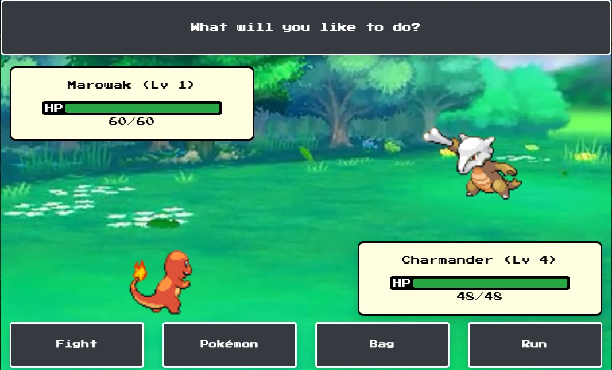
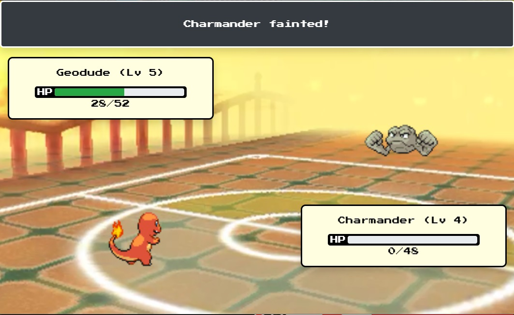


### Pokedex
- ✅ See the whole list of available Pokemon in the game
- ✅ Tapping on any of the cards will show their relevant information

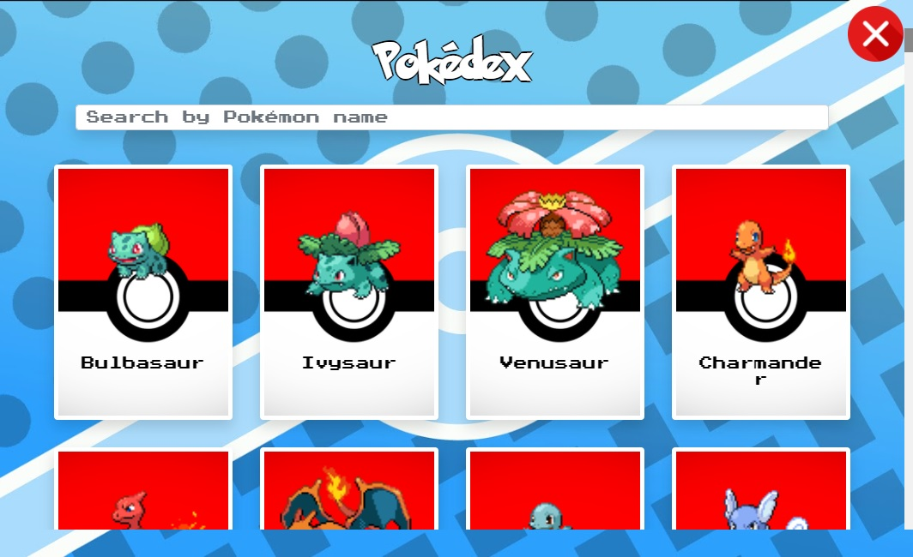
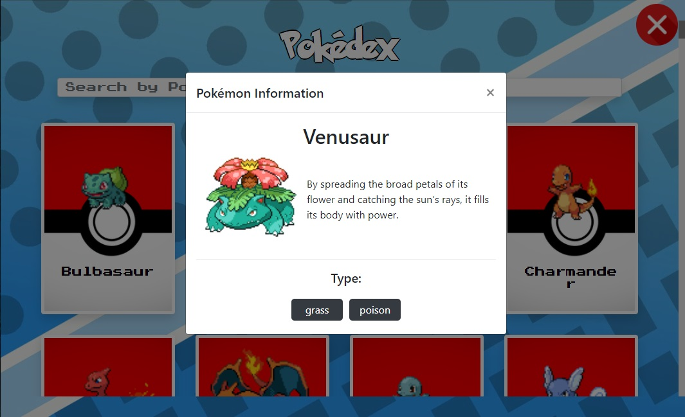

### Pokemon
- ✅ See the Pokemon available in your party and their relavant information
- ✅ Clicking on move names toggle between the move name and their effects
- ✅ Selecting USE R. CANDY allows you to use obtained Rare Candies to upgrade your Pokemon levels and stats!

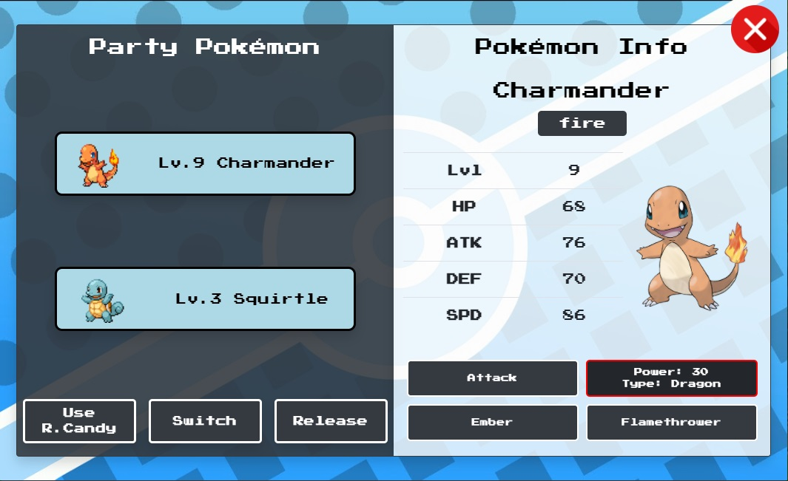
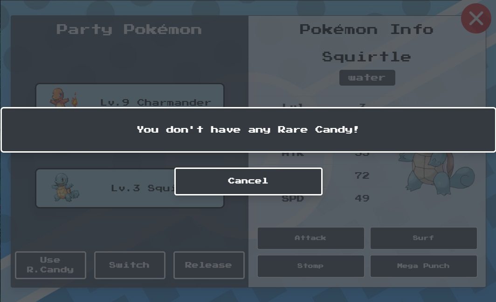


# Technologies
- VueJS and CSS for structuring and styling the website
- Javascript to implement interactivty with website
- [BootstrapVue](https://bootstrap-vue.org/) for Navbar and other Bootstrap components
- GitHub for version control and repositories
- GitPod as coding platform
- Axios to read from JSON files and database
- Express, HBS for data rendering
- GIMP for image editing
- Responsive Web Design Checker to check how it looks like on other devices

# Deployment
## Steps taken to deploy the project to Github pages (Credits to Paul Chor for a detailed and simple guide)
```
1. Login to my Gitpod to access the code
2. Update publicPath folder in vue.config.json
3. Create the deployment script: deploy.sh
4. Change the file permissions of deploy.sh and perform the deployment to Github pages
5. Login to GitHub and click on my repository
6. Select the TGC9-Proj2-PokeLegends-vue repository
7. Navigate to the Setting (Gear icon)
8. Scroll down to the GitHub Pages section and ensure that our live site is reading from the gh-pages branch
9. View and test the site at: https://yuhengen.github.io/TGC9-Proj2-PokeLegends-vue/
```

# Credits
## Acknowledgement
This project would not have been possible without my main lecturer, Paul Chor, for the skills and knowledge imparted to me, and teaching assistant, Shun, for the guidance during the building of the project during the bootcamp in Trent Global College.
Big appreciation to the Pokémon series, w3schools, Stackoverflow forums, Bootstrap documentation, PokéAPI and its documentation.

- [POKÉMON](https://www.Pokémon.com/sg/) for the series and the assets
- [Pokémon API](https://pokeapi.co/)
- [Pokémon Font](https://www.dafont.com/Pokémon.font)
- [Nintendo Pixel Font](https://www.fontspace.com/press-start-2p-font-f11591)
- [Vue Fullscreen](http://mirari.cc/vue-fullscreen/) for granting fullscreen to the game window
- [Vuex-PersistedState](https://www.npmjs.com/package/vuex-persistedstate) for simple inter-component state control
- [Am I Responsive Checker](http://ami.responsivedesign.is/) to check for mobile responsiveness

### Images
All images are used from their sources and links (None of them are downloaded). All credits and copyright goes to the Pokemon series and their original artists

### Music
- intro.mp3 - [Professor Oak - Pokémon Masters](https://www.youtube.com/watch?v=1Z8twVQ0fDo)
- select.mp3 - [Pokémon Red/Blue/Yellow - Pressing A - Sound Effect](https://www.youtube.com/watch?v=88qRmxhqoBA)
- theme-music.mp3 - [POKÉMON Omega Ruby/Alpha Sapphire Title Theme](https://www.youtube.com/watch?v=hkoXy3jRpww)
- town.mp3 - [POKÉMON Omega Ruby/Alpha Sapphire Littleroot Town Theme](https://www.youtube.com/watch?v=zRGCzCn5azI)
- menu.mp3 - [POKÉMON Sword & Shield Pokémon Center Theme](https://www.youtube.com/watch?v=i6yQhdtTM2o)
- random-battle.mp3 - [POKÉMON Omega Ruby/Alpha Sapphire Battle! Zinnia Theme](https://www.youtube.com/watch?v=GIn8_Q27WFY)
- gymbattle.mp3 - [Pokémon HeartGold/SoulSilver - Battle! Kanto Gym Leader Music (HQ)](https://www.youtube.com/watch?v=T4SYTwP76qM)
- attack.mp3 - [Pokémon Red/Blue/Yellow - Cut - Sound Effect](https://www.youtube.com/watch?v=2uhCrgM169A)
- run.mp3 - [Pokémon Red/Blue/Yellow - Level Up - Sound Effect](https://www.youtube.com/watch?v=OGXUoqSYscc)